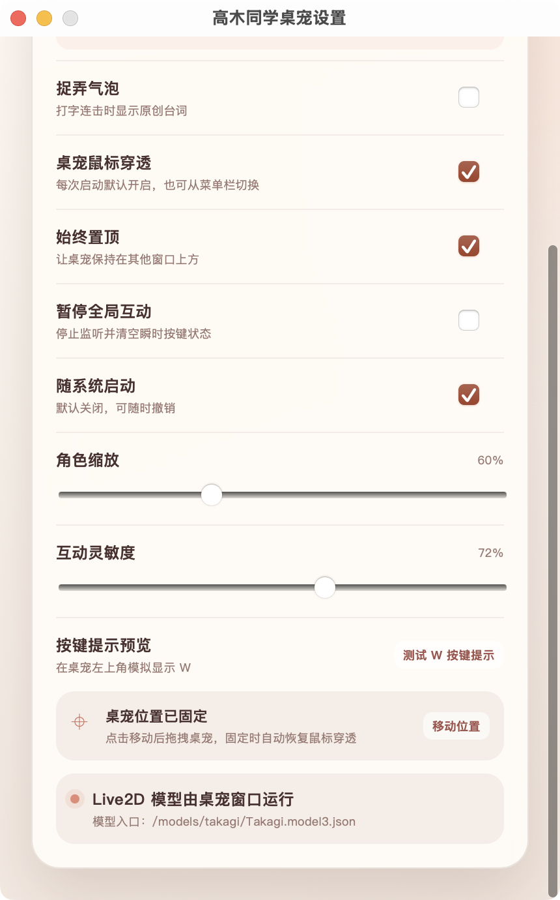

# 高木同学 Live2D 桌宠

一个支持 macOS 与 Windows 的非官方同人桌宠。角色会眨眼、看向鼠标，并根据真实键盘和鼠标操作做出动作。

## 效果预览

以下图片来自 macOS 成品的实际运行画面，桌宠窗口背景为透明。

| Q 键 | W 键 | T 键 |
| --- | --- | --- |
|  |  |  |

## 主要功能

- 透明、置顶并默认鼠标穿透，不会挡住桌面点击。
- 眼睛跟随鼠标位置，角色会自动眨眼。
- 键盘手会移动到画面上对应的真实键位。
- 鼠标、手套和完整鼠标手臂作为一个整体移动。
- 左上角气泡会短暂显示刚按下的按键。
- 支持缩放、互动灵敏度、始终置顶、暂停互动和开机启动设置。

## 下载

请在仓库的 **Releases** 页面选择对应系统：

- macOS Apple Silicon：`Takagi-Live2D-Desktop-Pet_0.1.0_macos-arm64.zip`
- Windows 10/11 x64：`Takagi-Live2D-Desktop-Pet_0.1.0_windows-x64-setup.exe`

## macOS 使用方法

1. 解压 ZIP，将 `高木同学桌宠.app` 移到“应用程序”。
2. 首次启动时右键应用并选择“打开”。
3. 在“系统设置 → 隐私与安全性”中允许“辅助功能”和“输入监控”。
4. 完全退出后重新启动桌宠。
5. 从菜单栏图标打开设置、暂停互动、切换鼠标穿透或退出。

找不到桌宠或需要切换鼠标穿透时，按 `Command + Shift + T`。

## Windows 使用方法

1. 运行名称以 `_x64-setup.exe` 结尾的安装程序。
2. 如 SmartScreen 显示提醒，请先确认文件来自本仓库的正式 Release。
3. 启动后从系统托盘图标打开设置、暂停互动或退出。

找不到桌宠或需要切换鼠标穿透时，按 `Ctrl + Shift + T`。

## 使用提示

- 桌宠启动后默认允许鼠标点击穿透。
- 设置入口只在 macOS 菜单栏或 Windows 系统托盘中，不在桌宠画面上显示。
- Windows 若被安全软件阻止全局互动，请只对白名单中的正式安装包放行。
- 当前安装包未进行 Apple 公证或 Windows 商业代码签名，因此系统可能显示安全提醒。

## 隐私

全局键鼠监听只用于本机动画。应用不联网发送输入内容，也不保存输入文本、密码、剪贴板、按键历史、前台应用或窗口标题。

## 版权说明

这是非官方同人项目，与原作者、出版社、动画制作方及 Live2D Inc. 均无隶属或背书关系。角色形象及相关权利归各自权利人所有，请仅在法律和权利人允许的范围内进行个人、非商业使用。

Live2D 组件的相关许可说明见 `public/live2d/README.md`。
